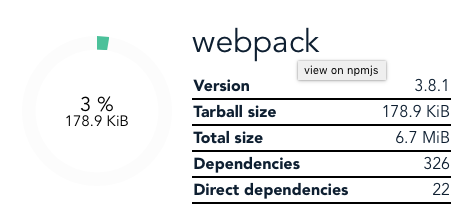
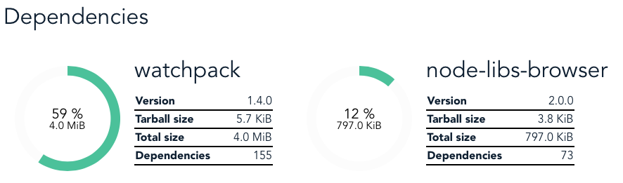

# npm-download-size

> explore size of npm packages

https://arve0.github.io/npm-download-size


Also availabel as cli: https://github.com/arve0/npm-download-size-cli

API: https://github.com/arve0/npm-download-size-api


## Usage

Start with entering the name of a package:


Statistics of package is shown in top. Percentage is package size relative to complete size (all depedencies). Click on the package name to go to npmjs.



Below are direct dependencies. Click on their names to analyze them.



## Build Setup

``` bash
# install dependencies
npm install

# serve with hot reload at localhost:8080
npm run dev

# build for production with minification
npm run build
```

For detailed explanation on how things work, consult the [docs for vue-loader](http://vuejs.github.io/vue-loader).
