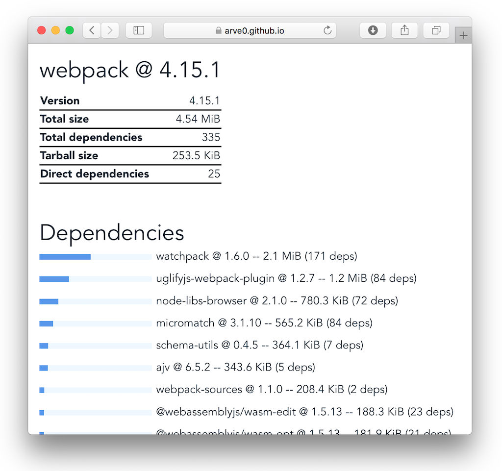
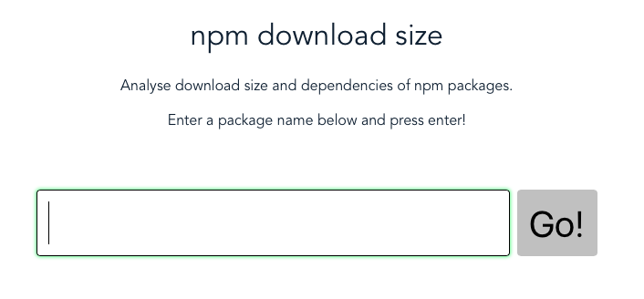

# npm-download-size

> explore size of npm packages

https://arve0.github.io/npm-download-size



Also availabel as cli: https://github.com/arve0/npm-download-size-cli

API: https://github.com/arve0/npm-download-size-api


## Usage

Start with entering the name of a package:



Press enter, and you will get the statistics.


Click on dependencies to show their statistics. If you click on the package name, you will be forwarded to npmjs.

## Development

``` bash
# install dependencies
npm install

# serve with hot reload at localhost:8080
npm start

# build for production with minification
npm run build
```

For detailed explanation on how things work, consult the [docs for vue-loader](http://vuejs.github.io/vue-loader).
